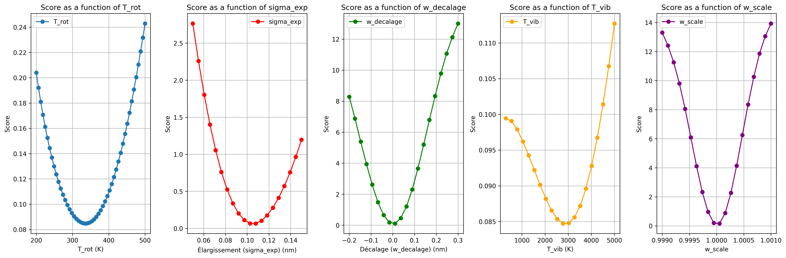
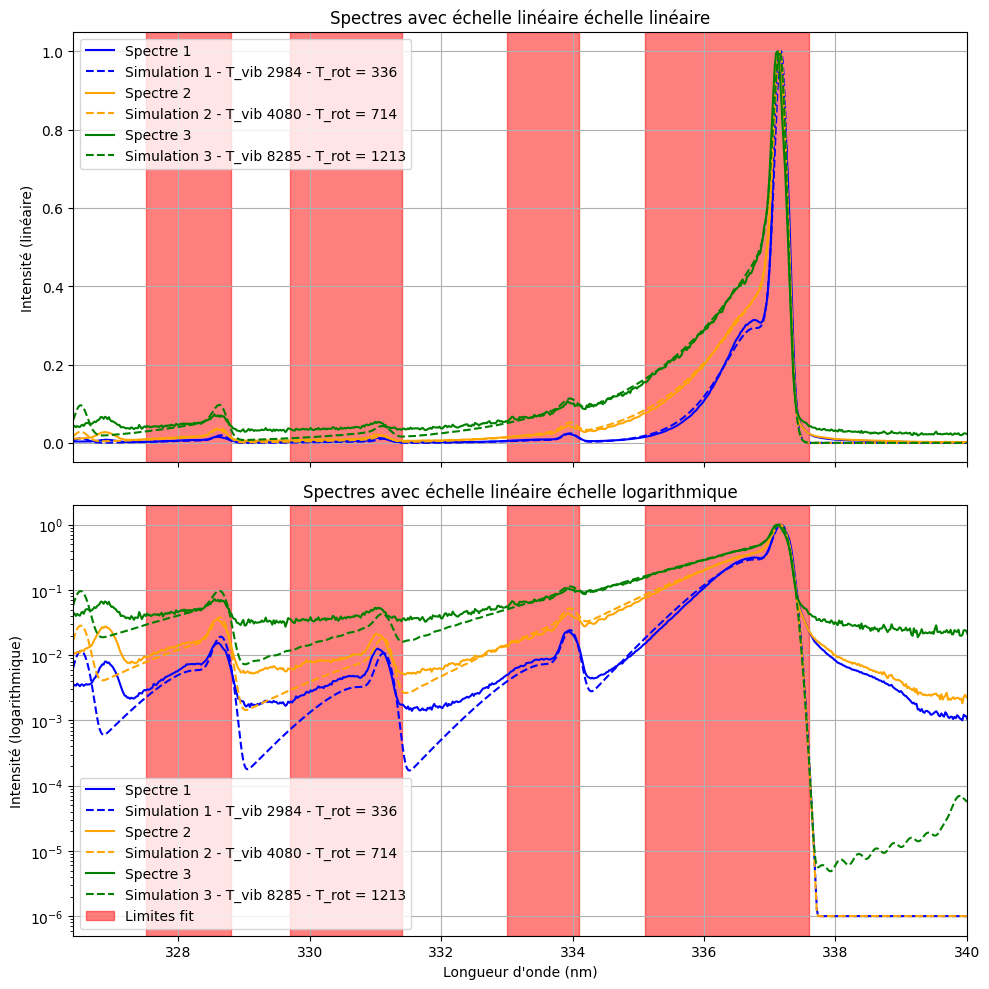

# X-Spectra

X-Spectra is a Python library designed for the spectral analysis of nitrogen plasma. It provides tools for data processing, spectral simulation, and visualization, making it easier to automate scientific calculations and analyze experimental data.

## Features

- **Data Processing**: Filter, normalize, and cut spectral data.
- **Spectral Analysis**: Extract peaks, calculate temperatures (vibrational and rotational), and analyze spectral lines.
- **Simulation**: Generate synthetic spectra using physical models.
- **Visualization**: Plot spectra, scores, and matches for better insights.

## Requirements

The following Python packages are required to use X-Spectra:

- `astropy==7.0.1`
- `astroquery==0.4.9.post1`
- `imageio==2.37.0`
- `matplotlib==3.10.1`
- `numpy==2.2.5`
- `pandas==2.2.3`
- `scipy==1.15.2`

You can install these dependencies using the `requirements.txt` file:

```bash
pip install -r requirements.txt
```

## Installation

Clone the repository and install the required dependencies:

```bash
git clone https://github.com/your-repo/xspectra.git
cd xspectra
pip install -r requirements.txt
```

## Usage

Check the examples folder !

## Simulation 

The project includes a nitrogen spectrum simulation tool that, when adjusted to the studied spectrum, allows determining the rotational temperature, as well as the broadening and wavelength shift caused by calibration errors. This fitting process is performed using trichotomy, as the distance between the simulation spectrum and the studied spectrum is a convex function of the parameters, as shown in the following figure:

<div align="center">
    
</div>

This results in robust fits, as demonstrated in the examples:

<div align="center">
    
</div>

## Bin - Commmand line tool

The `bin` module provides a command-line interface for processing spectrum files to calculate vibrational and rotational temperatures. It supports background removal, peak detection, and fitting with a simulation spectrum. Results can be saved to a specified folder, and plots can be displayed or saved.

### Usage


```bash
>>> python -m xspectra.bin ./examples/data/temperature_analysis
Processing files: 100%|█████████████████████████████████████████| 3/3 [00:09<00:00,  3.28s/it]
+-------------+------------------------+------------------------------+-------------------+-----------------------------+------------+
|   T_vib (K) | T_rot (K) - R branch   |   T_rot (K) - fit simulation |   Broadening (nm) |   Wavelength Deviation (nm) | Filename   |
+=============+========================+==============================+===================+=============================+============+
|     808.233 | 302 ± 14               |                          255 |             0.086 |                       0.104 | 1.txt      |
+-------------+------------------------+------------------------------+-------------------+-----------------------------+------------+
|     823.692 | 312 ± 8                |                          269 |             0.086 |                       0.102 | 2.txt      |
+-------------+------------------------+------------------------------+-------------------+-----------------------------+------------+
|     832.07  | 363 ± 16               |                          305 |             0.085 |                       0.099 | 3.txt      |
+-------------+------------------------+------------------------------+-------------------+-----------------------------+------------+
```

Check the [documentation](docs.md) for more info !


## Structure 

- `src/spectra` contains the library with the following subpackages :
  - `atom` specialized in atom spectra analysis
  - `utils` containing some global tools to analyse spectra
  - `simulation` to generate theorical spectra of diatomic molecules
  - `visualization` to display some visual data 
- `examples` contains usage examples of the library, including scripts for spectral analysis and simulation.
  - `data` useful for the examples
  - `pdf` contains pdf versions of the jupyters
- `pictures` contains images used in the documentation, such as simulation graphs and score plots.
- `requirements.txt` lists the dependencies required to run the project.
- `README.md` provides an overview of the project, its features, and instructions for installation and usage.
- `docs.md` contains detailed documentation for users and developers.
- `LICENSE` specifies the terms of the project's license.
- `CONTRIBUTING.md` explains how to contribute to the project, including guidelines for pull requests and bug reports.


## Documentation

Detailed documentation is available in the `docs.md` file. It includes descriptions and examples for all the functions provided by the library.

## Contributing

Contributions are welcome! If you have suggestions or improvements, feel free to open an issue or submit a pull request.
Check the [CONTRIBUTING](CONTRIBUTING.md) section. 

## License

This project is licensed under the GNU Lesser General Public License v3 (LGPL-3.0). See the `LICENSE` file for details.

## Acknowledgments

This library was developed as part of the MODAL project in 2025 for the spectral study of nitrogen plasma.

---

# X-Spectra

X-Spectra est une bibliothèque Python conçue pour l'analyse spectrale du plasma d'azote. Elle fournit des outils pour le traitement des données, la simulation spectrale et la visualisation, facilitant ainsi l'automatisation des calculs scientifiques et l'analyse des données expérimentales.

## Fonctionnalités

- **Traitement des données** : Filtrer, normaliser et découper les données spectrales.
- **Analyse spectrale** : Extraire les pics, calculer les températures (vibrationnelle et rotationnelle) et analyser les raies spectrales.
- **Simulation** : Générer des spectres synthétiques à l'aide de modèles physiques.
- **Visualisation** : Tracer des spectres, des scores et des correspondances pour une meilleure compréhension.

## Prérequis

Les packages Python suivants sont nécessaires pour utiliser X-Spectra :

- `astropy==7.0.1`
- `astroquery==0.4.9.post1`
- `imageio==2.37.0`
- `matplotlib==3.10.1`
- `numpy==2.2.5`
- `pandas==2.2.3`
- `scipy==1.15.2`

Vous pouvez installer ces dépendances en utilisant le fichier `requirements.txt` :

```bash
pip install -r requirements.txt
```

## Installation

Clonez le dépôt et installez les dépendances requises :

```bash
git clone https://github.com/your-repo/xspectra.git
cd xspectra
pip install -r requirements.txt
```

## Utilisation

Consultez le dossier d'exemples !

## Simulation 

Le projet inclut un outil de simulation de spectre d'azote qui, une fois ajusté au spectre étudié, permet de déterminer la température rotationnelle, ainsi que l'élargissement et le décalage en longueur d'onde causés par des erreurs de calibration. Ce processus d'ajustement est réalisé à l'aide de la trichotomie, car la distance entre le spectre simulé et le spectre étudié est une fonction convexe des paramètres, comme illustré dans la figure suivante :

<div align="center">
    
</div>

Cela aboutit à des ajustements robustes, comme démontré dans les exemples :

<div align="center">
    
</div>

## Bin - Outil en ligne de commande

Le module `bin` fournit une interface en ligne de commande pour traiter les fichiers de spectre afin de calculer les températures vibrationnelle et rotationnelle. Il prend en charge la suppression de l'arrière-plan, la détection des pics et l'ajustement avec un spectre simulé. Les résultats peuvent être enregistrés dans un dossier spécifié, et les graphiques peuvent être affichés ou sauvegardés.

### Utilisation

```bash
>>> python -m xspectra.bin ./examples/data/temperature_analysis
Traitement des fichiers : 100%|█████████████████████████████████████████| 3/3 [00:09<00:00,  3.28s/it]
+-------------+------------------------+------------------------------+-------------------+-----------------------------+------------+
|   T_vib (K) | T_rot (K) - branche R  |   T_rot (K) - simulation fit |   Élargissement (nm) |   Déviation en longueur d'onde (nm) | Fichier   |
+=============+========================+==============================+===================+=============================+============+
|     808.233 | 302 ± 14               |                          255 |             0.086 |                       0.104 | 1.txt      |
+-------------+------------------------+------------------------------+-------------------+-----------------------------+------------+
|     823.692 | 312 ± 8                |                          269 |             0.086 |                       0.102 | 2.txt      |
+-------------+------------------------+------------------------------+-------------------+-----------------------------+------------+
|     832.07  | 363 ± 16               |                          305 |             0.085 |                       0.099 | 3.txt      |
+-------------+------------------------+------------------------------+-------------------+-----------------------------+------------+
```

Consultez la [documentation](docs.md) pour plus d'informations !

## Structure 

- `src/spectra` contient la bibliothèque avec les sous-packages suivants :
  - `atom` spécialisé dans l'analyse des spectres atomiques
  - `utils` contenant des outils globaux pour analyser les spectres
  - `simulation` pour générer des spectres théoriques de molécules diatomiques
  - `visualization` pour afficher des données visuelles
- `examples` contient des exemples d'utilisation de la bibliothèque, y compris des scripts pour l'analyse spectrale et la simulation.
  - `data` utile pour les exemples
  - `pdf` contient les versions PDF des notebooks Jupyter
- `pictures` contient des images utilisées dans la documentation, telles que des graphiques de simulation et des tracés de scores.
- `requirements.txt` liste les dépendances nécessaires pour exécuter le projet.
- `README.md` fournit une vue d'ensemble du projet, de ses fonctionnalités et des instructions pour l'installation et l'utilisation.
- `docs.md` contient une documentation détaillée pour les utilisateurs et les développeurs.
- `LICENSE` spécifie les termes de la licence du projet.
- `CONTRIBUTING.md` explique comment contribuer au projet, y compris les directives pour les pull requests et les rapports de bugs.

## Documentation

Une documentation détaillée est disponible dans le fichier `docs.md`. Elle inclut des descriptions et des exemples pour toutes les fonctions fournies par la bibliothèque.

## Contribuer

Les contributions sont les bienvenues ! Si vous avez des suggestions ou des améliorations, n'hésitez pas à ouvrir une issue ou à soumettre une pull request.
Consultez la section [CONTRIBUTING](CONTRIBUTING.md).

## Licence

Ce projet est sous licence GNU Lesser General Public License v3 (LGPL-3.0). Consultez le fichier `LICENSE` pour plus de détails.

## Remerciements

Cette bibliothèque a été développée dans le cadre du projet MODAL en 2025 pour l'étude spectrale du plasma d'azote.