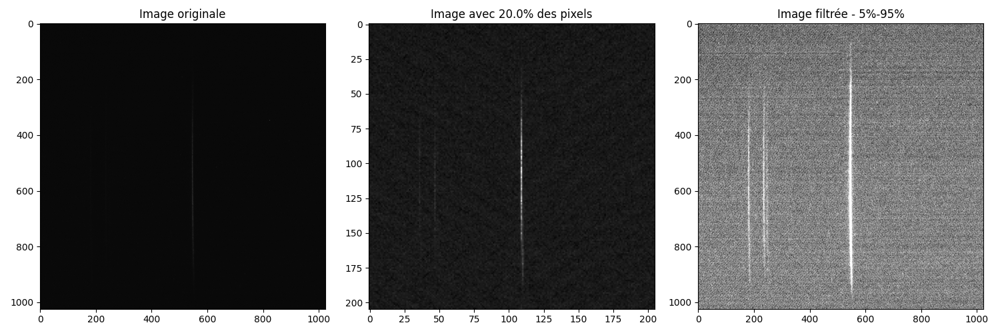
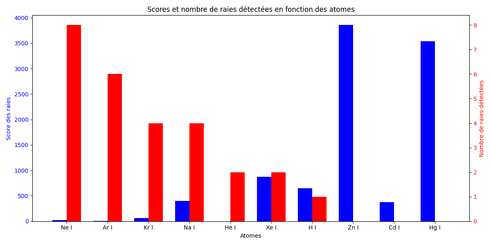
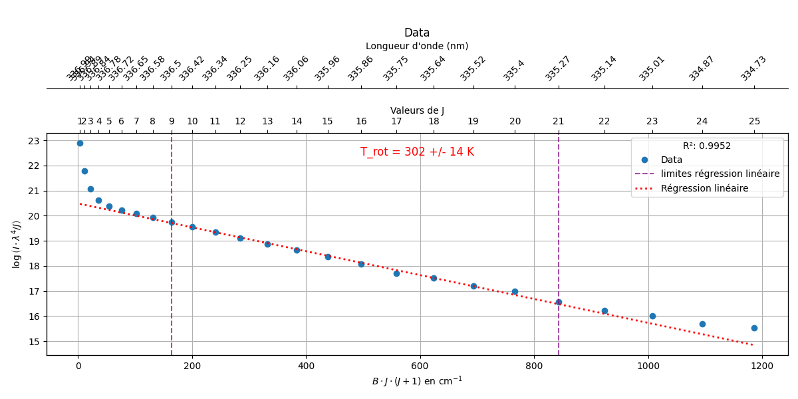

# X-Spectra


- [X-Spectra](#x-spectra)
  - [Introduction](#introduction)
  - [Utils](#utils)
    - [`filter_data(data, v=5)`](#filter_datadata-v5)
    - [`load_data(file)`](#load_datafile)
    - [`compute_spectra(data, normalize=True)`](#compute_spectradata-normalizetrue)
    - [`get_spectra(file, cut_proportion=0.75, filter_data_value=5, normalize=True)`](#get_spectrafile-cut_proportion075-filter_data_value5-normalizetrue)
    - [`borne_spectra(spectra, borne=5)`](#borne_spectraspectra-borne5)
    - [`get_maxima_image(filename)`](#get_maxima_imagefilename)
    - [`get_quantile_image(filename, q=0.95)`](#get_quantile_imagefilename-q095)
    - [`cut_data(data, cuts=None, proportion=0.75)`](#cut_datadata-cutsnone-proportion075)
    - [`get_points_folder(folder, method="maxima", kyrill=False)`](#get_points_folderfolder-methodmaxima-kyrillfalse)
    - [`calculate_temperature_single(spectrum, i1=529, i2=169)`](#calculate_temperature_singlespectrum-i1529-i2169)
    - [`extract_raies(spectrum, height=1e-2)`](#extract_raiesspectrum-height1e-2)
    - [`closest_peak_distance(raie, peaks)`](#closest_peak_distanceraie-peaks)
  - [Atom](#atom)
    - [`calculate_temperature_single(spectrum, i1=529, i2=169)`](#calculate_temperature_singlespectrum-i1529-i2169-1)
    - [`extract_raies(spectrum, height=1e-2)`](#extract_raiesspectrum-height1e-2-1)
    - [`closest_peak_distance(raie, peaks)`](#closest_peak_distanceraie-peaks-1)
    - [`score_rays(observed, target)`](#score_raysobserved-target)
    - [`get_nb_matches(observed, target, threshold=2)`](#get_nb_matchesobserved-target-threshold2)
  - [Simulation](#simulation)
    - [`get_energy_function_given_state(omega_e, omega_chi, T, B)`](#get_energy_function_given_stateomega_e-omega_chi-t-b)
    - [`get_botzmann_population_distribution(T_e, omega_e, omega_chi, B)`](#get_botzmann_population_distributiont_e-omega_e-omega_chi-b)
    - [`get_hl_factor(L1, L2, J1, J2)`](#get_hl_factorl1-l2-j1-j2)
    - [`get_A(l, L1, L2, v1, v2, J1, J2)`](#get_al-l1-l2-v1-v2-j1-j2)
    - [`get_spectrum(v1, v2, llims, nb_rot_levels, T_el, T_rot, T_vib, nb_points, sigma_exp, shape)`](#get_spectrumv1-v2-llims-nb_rot_levels-t_el-t_rot-t_vib-nb_points-sigma_exp-shape)
  - [Visualization](#visualization)
    - [`plot_spectra_with_rays(spectrum, longueurs_onde, rays, spectra_output=None)`](#plot_spectra_with_raysspectrum-longueurs_onde-rays-spectra_outputnone)
    - [`plot_scores_and_matches(atoms, scores, nb_matches, scores_output=None)`](#plot_scores_and_matchesatoms-scores-nb_matches-scores_outputnone)
    - [`show_result_calculation_Trot(wavelengths_target, spectrum_target, J_range=(8, 20), certainty=0.95, max_J=25, output_file=None, show=True)`](#show_result_calculation_trotwavelengths_target-spectrum_target-j_range8-20-certainty095-max_j25-output_filenone-showtrue)
    - [`analyse_spectrum(filename, l_min=200, l_max=850, resolution=13.9072e-12, top=10, height=1e-2, cibles=["Hg I", "H I", "He I", "Ne I", "Ar I", "Kr I", "Xe I", "Cd I", "Zn I", "Na I"], spectra_output=None, scores_output=None)`](#analyse_spectrumfilename-l_min200-l_max850-resolution139072e-12-top10-height1e-2-cibleshg-i-h-i-he-i-ne-i-ar-i-kr-i-xe-i-cd-i-zn-i-na-i-spectra_outputnone-scores_outputnone)
  - [Bin](#bin)
    - [Usage](#usage)
      - [Positional Arguments:](#positional-arguments)
      - [Optional Arguments:](#optional-arguments)
      - [Examples:](#examples)


## Introduction 

Cette librairie a été développée dans le cadre de mon MODAL de P3 en 2025 afin d'automatiser les calculs scientifiques réalisés pour l'étude spectrale de plasmas de diazote. 

## Utils

### `filter_data(data, v=5)`
Filtre les données pour ne conserver que les valeurs comprises entre les percentiles `v` et `100-v`.

**Paramètres :**
- `data` (numpy.ndarray) : Les données à filtrer.
- `v` (int, optionnel) : Le pourcentage pour les bornes inférieure et supérieure. Par défaut : 5.

**Exemple :**
```python
import numpy as np
from xspectra.utils import filter_data

data = np.array([1, 2, 3, 4, 5, 100])
filtered = filter_data(data, v=10)
print(filtered)  # [2, 2, 3, 4, 5, 5]
```

---

### `load_data(file)`
Charge une image ou un fichier de données.

**Paramètres :**
- `file` (str) : Chemin du fichier à charger.

**Exemple :**
```python
from xspectra.utils import load_data

data = load_data("example_image.tiff")
print(data.shape)  # Affiche les dimensions de l'image.
```



---

### `compute_spectra(data, normalize=True)`
Calcule le spectre en sommant les données sur un axe.

**Paramètres :**
- `data` (numpy.ndarray) : Les données d'entrée.
- `normalize` (bool, optionnel) : Si `True`, normalise le spectre. Par défaut : `True`.

**Exemple :**
```python
from xspectra.utils import compute_spectra

spectrum = compute_spectra(data)
print(spectrum)
```

---

### `get_spectra(file, cut_proportion=0.75, filter_data_value=5, normalize=True)`
Charge un fichier, filtre et coupe les données, puis calcule le spectre.

**Paramètres :**
- `file` (str) : Chemin du fichier.
- `cut_proportion` (float, optionnel) : Proportion des données à conserver. Par défaut : 0.75.
- `filter_data_value` (int, optionnel) : Valeur pour le filtrage. Par défaut : 5.
- `normalize` (bool, optionnel) : Si `True`, normalise le spectre. Par défaut : `True`.

**Exemple :**
```python
from xspectra.utils import get_spectra

spectrum = get_spectra("example_image.tiff")
print(spectrum)
```

---

### `borne_spectra(spectra, borne=5)`
Applique des bornes au spectre pour limiter les valeurs extrêmes.

**Paramètres :**
- `spectra` (numpy.ndarray) : Le spectre à traiter.
- `borne` (int, optionnel) : Pourcentage pour la borne supérieure. Par défaut : 5.

**Exemple :**
```python
from xspectra.utils import borne_spectra

bounded_spectrum = borne_spectra(spectrum)
print(bounded_spectrum)
```

---

### `get_maxima_image(filename)`
Renvoie la valeur maximale d'une image.

**Paramètres :**
- `filename` (str) : Chemin du fichier image.

**Exemple :**
```python
from xspectra.utils import get_maxima_image

max_value = get_maxima_image("example_image.tiff")
print(max_value)
```

---

### `get_quantile_image(filename, q=0.95)`
Renvoie le quantile `q` d'une image.

**Paramètres :**
- `filename` (str) : Chemin du fichier image.
- `q` (float, optionnel) : Quantile à calculer. Par défaut : 0.95.

**Exemple :**
```python
from xspectra.utils import get_quantile_image

quantile = get_quantile_image("example_image.tiff", q=0.9)
print(quantile)
```

---

### `cut_data(data, cuts=None, proportion=0.75)`
Coupe les données selon une proportion ou des indices spécifiques.

**Paramètres :**
- `data` (numpy.ndarray) : Les données à couper.
- `cuts` (tuple, optionnel) : Indices de début et de fin pour la coupe.
- `proportion` (float, optionnel) : Proportion des données à conserver. Par défaut : 0.75.

**Exemple :**
```python
from xspectra.utils import cut_data

cut_data = cut_data(data, proportion=0.5)
print(cut_data)
```

---

### `get_points_folder(folder, method="maxima", kyrill=False)`
Récupère les points d'un dossier contenant des fichiers `.SPE`.

**Paramètres :**
- `folder` (str) : Chemin du dossier.
- `method` (str, optionnel) : Méthode pour extraire les points. Par défaut : "maxima".
- `kyrill` (bool, optionnel) : Si `True`, utilise un format spécifique pour les noms de fichiers. Par défaut : `False`.

**Exemple :**
```python
from xspectra.utils import get_points_folder

delays, values = get_points_folder("data_folder")
print(delays, values)
```

---

### `calculate_temperature_single(spectrum, i1=529, i2=169)`
Calcule la température vibrationnelle à partir d'un spectre.

**Paramètres :**
- `spectrum` (numpy.ndarray) : Le spectre à analyser.
- `i1` (int, optionnel) : Indice du premier pic. Par défaut : 529.
- `i2` (int, optionnel) : Indice du second pic. Par défaut : 169.

**Exemple :**
```python
from xspectra.utils import calculate_temperature_single

temperature = calculate_temperature_single(spectrum)
print(temperature)
```

---

### `extract_raies(spectrum, height=1e-2)`
Extrait les indices des raies détectées dans un spectre.

**Paramètres :**
- `spectrum` (numpy.ndarray) : Le spectre à analyser.
- `height` (float, optionnel) : Hauteur minimale des pics. Par défaut : 1e-2.

**Exemple :**
```python
from xspectra.utils import extract_raies

peaks = extract_raies(spectrum)
print(peaks)
```

---

### `closest_peak_distance(raie, peaks)`
Calcule la distance entre une raie donnée et le pic le plus proche.

**Paramètres :**
- `raie` (float) : Longueur d'onde de la raie.
- `peaks` (numpy.ndarray) : Longueurs d'onde des pics détectés.

**Exemple :**
```python
from xspectra.utils import closest_peak_distance

distance = closest_peak_distance(500, peaks)
print(distance)
```

## Atom

The goal of this section is to give tools to identify atoms by comparing the spectrum to knwon atom rays, giving such results : 



### `calculate_temperature_single(spectrum, i1=529, i2=169)`
Calcule la température vibrationnelle à partir d'un spectre.

**Paramètres :**
- `spectrum` (numpy.ndarray) : Le spectre à analyser.
- `i1` (int, optionnel) : Indice du premier pic. Par défaut : 529.
- `i2` (int, optionnel) : Indice du second pic. Par défaut : 169.

**Exemple :**
```python
from xspectra.atom import calculate_temperature_single

spectrum = [0, 1, 3, 7, 5, 2, 0]  # Exemple de spectre
temperature = calculate_temperature_single(spectrum, i1=3, i2=4)
print(temperature)
```

---

### `extract_raies(spectrum, height=1e-2)`
Extrait les indices des raies détectées dans un spectre.

**Paramètres :**
- `spectrum` (numpy.ndarray) : Le spectre à analyser.
- `height` (float, optionnel) : Hauteur minimale des pics. Par défaut : 1e-2.

**Exemple :**
```python
from xspectra.atom import extract_raies

spectrum = [0, 1, 3, 7, 5, 2, 0]  # Exemple de spectre
peaks = extract_raies(spectrum, height=2)
print(peaks)  # [3]
```

---

### `closest_peak_distance(raie, peaks)`
Calcule la distance entre une raie donnée et le pic le plus proche.

**Paramètres :**
- `raie` (float) : Longueur d'onde de la raie.
- `peaks` (numpy.ndarray) : Longueurs d'onde des pics détectés.

**Exemple :**
```python
from xspectra.atom import closest_peak_distance

raie = 540
peaks = [530, 535, 550]
distance = closest_peak_distance(raie, peaks)
print(distance)  # 5
```

---

### `score_rays(observed, target)`
Calcule le score des raies observées par rapport aux raies cibles.

**Paramètres :**
- `observed` (numpy.ndarray) : Les longueurs d'onde des raies observées.
- `target` (numpy.ndarray) : Les longueurs d'onde des raies cibles.

**Exemple :**
```python
from xspectra.atom import score_rays

observed = [540, 550, 560]
target = [545, 555]
score = score_rays(observed, target)
print(score)  # Exemple de score
```

---

### `get_nb_matches(observed, target, threshold=2)`
Calcule le nombre de raies observées qui correspondent à des raies cibles.

**Paramètres :**
- `observed` (numpy.ndarray) : Les longueurs d'onde des raies observées.
- `target` (numpy.ndarray) : Les longueurs d'onde des raies cibles.
- `threshold` (float, optionnel) : Distance maximale pour considérer une raie comme détectée. Par défaut : 2.

**Exemple :**
```python
from xspectra.atom import get_nb_matches

observed = [540, 550, 560]
target = [545, 555]
matches = get_nb_matches(observed, target, threshold=5)
print(matches)  # 2
```

## Simulation

### `get_energy_function_given_state(omega_e, omega_chi, T, B)`
Renvoie une fonction pour calculer les énergies électroniques, vibrationnelles et rotationnelles d'un état donné.

**Paramètres :**
- `omega_e` (float) : Constante vibrationnelle en cm⁻¹.
- `omega_chi` (float) : Constante d'anharmonicité en cm⁻¹.
- `T` (float) : Énergie électronique en cm⁻¹.
- `B` (float) : Constante rotationnelle en cm⁻¹.

**Exemple :**
```python
from xspectra.simulation import get_energy_function_given_state

energy_function = get_energy_function_given_state(omega_e=2047.17, omega_chi=28.445, T=89136.9, B=1.825)
E_e, E_vib, E_rot, E_total = energy_function(v=0, j=1)
print(E_total)  # Énergie totale en cm⁻¹
```

---

### `get_botzmann_population_distribution(T_e, omega_e, omega_chi, B)`
Renvoie une fonction pour calculer la distribution de population de Boltzmann pour un état donné.

**Paramètres :**
- `T_e` (float) : Énergie électronique en cm⁻¹.
- `omega_e` (float) : Constante vibrationnelle en cm⁻¹.
- `omega_chi` (float) : Constante d'anharmonicité en cm⁻¹.
- `B` (float) : Constante rotationnelle en cm⁻¹.

**Exemple :**
```python
from xspectra.simulation import get_botzmann_population_distribution

population_distribution = get_botzmann_population_distribution(T_e=89136.9, omega_e=2047.17, omega_chi=28.445, B=1.825)
population = population_distribution(v=0, J=1, T_el=300, T_rot=300, T_vib=300)
print(population)  # Probabilité de population
```

---

### `get_hl_factor(L1, L2, J1, J2)`
Calcule le facteur de Hönl-London pour une transition entre deux états.

**Paramètres :**
- `L1` (int) : Nombre quantique de moment angulaire de l'état supérieur.
- `L2` (int) : Nombre quantique de moment angulaire de l'état inférieur.
- `J1` (int) : Niveau rotationnel de l'état supérieur.
- `J2` (int) : Niveau rotationnel de l'état inférieur.

**Exemple :**
```python
from xspectra.simulation import get_hl_factor

hl_factor = get_hl_factor(L1=1, L2=0, J1=2, J2=1)
print(hl_factor)  # Facteur de Hönl-London
```

---

### `get_A(l, L1, L2, v1, v2, J1, J2)`
Calcule le coefficient d'Einstein A pour une transition donnée.

**Paramètres :**
- `l` (float) : Longueur d'onde de la transition en nm.
- `L1` (int) : Nombre quantique de moment angulaire de l'état supérieur.
- `L2` (int) : Nombre quantique de moment angulaire de l'état inférieur.
- `v1` (int) : Niveau vibrationnel de l'état supérieur.
- `v2` (int) : Niveau vibrationnel de l'état inférieur.
- `J1` (int) : Niveau rotationnel de l'état supérieur.
- `J2` (int) : Niveau rotationnel de l'état inférieur.

**Exemple :**
```python
from xspectra.simulation import get_A

A = get_A(l=337.1, L1=1, L2=0, v1=0, v2=0, J1=2, J2=1)
print(A)  # Coefficient d'Einstein A
```

---

### `get_spectrum(v1, v2, llims, nb_rot_levels, T_el, T_rot, T_vib, nb_points, sigma_exp, shape)`
Génère un spectre pour une transition donnée.

**Paramètres :**
- `v1` (int) : Niveau vibrationnel supérieur.
- `v2` (int) : Niveau vibrationnel inférieur.
- `llims` (tuple) : Limites des longueurs d'onde (min, max) en nm.
- `nb_rot_levels` (int) : Nombre de niveaux rotationnels.
- `T_el` (float) : Température électronique en K.
- `T_rot` (float) : Température rotationnelle en K.
- `T_vib` (float) : Température vibrationnelle en K.
- `nb_points` (int) : Nombre de points dans le spectre.
- `sigma_exp` (float) : Largeur de la gaussienne pour le lissage.
- `shape` (callable) : Fonction de forme (e.g., gaussienne).

**Exemple :**
```python
from xspectra.simulation import get_spectrum, gaussian

wavelengths, spectrum = get_spectrum(
    v1=0, v2=0, llims=(328, 340), nb_rot_levels=60, 
    T_el=1000, T_rot=1000, T_vib=300, nb_points=1000, 
    sigma_exp=0.1, shape=gaussian
)
print(wavelengths, spectrum)  # Longueurs d'onde et intensités
```


## Visualization

### `plot_spectra_with_rays(spectrum, longueurs_onde, rays, spectra_output=None)`
Affiche un spectre avec les raies des différents atomes.

**Paramètres :**
- `spectrum` (numpy.ndarray) : Le spectre à afficher.
- `longueurs_onde` (numpy.ndarray) : Les longueurs d'onde correspondantes.
- `rays` (list) : La liste des raies pour chaque atome.
- `spectra_output` (str, optionnel) : Chemin pour sauvegarder le graphique. Par défaut : `None`.

**Exemple :**
```python
from xspectra.visualization import plot_spectra_with_rays

spectrum = [0, 1, 3, 7, 5, 2, 0]  # Exemple de spectre
longueurs_onde = [400, 450, 500, 550, 600, 650, 700]  # Longueurs d'onde
rays = [[450, 550], [500, 600]]  # Raies pour deux atomes
plot_spectra_with_rays(spectrum, longueurs_onde, rays)
```

---

### `plot_scores_and_matches(atoms, scores, nb_matches, scores_output=None)`
Affiche les scores et le nombre de raies détectées pour différents atomes.

**Paramètres :**
- `atoms` (list) : Liste des noms des atomes.
- `scores` (list) : Scores des raies pour chaque atome.
- `nb_matches` (list) : Nombre de raies détectées pour chaque atome.
- `scores_output` (str, optionnel) : Chemin pour sauvegarder le graphique. Par défaut : `None`.

**Exemple :**
```python
from xspectra.visualization import plot_scores_and_matches

atoms = ["Ne I", "Ar I"]
scores = [10.5, 8.2]
nb_matches = [5, 3]
plot_scores_and_matches(atoms, scores, nb_matches)
```

### `show_result_calculation_Trot(wavelengths_target, spectrum_target, J_range=(8, 20), certainty=0.95, max_J=25, output_file=None, show=True)`
Visualise les résultats du calcul de la température rotationnelle (T_rot) à l'aide d'une méthode logarithmique.

**Paramètres :**
- `wavelengths_target` (numpy.ndarray) : Longueurs d'onde cibles.
- `spectrum_target` (numpy.ndarray) : Spectre cible.
- `J_range` (tuple, optionnel) : Plage des nombres quantiques (J) pour la régression linéaire. Par défaut : `(8, 20)`.
- `certainty` (float, optionnel) : Niveau de confiance pour le calcul de l'incertitude. Par défaut : `0.95`.
- `max_J` (int, optionnel) : Nombre quantique maximal à considérer. Par défaut : `25`.
- `output_file` (str, optionnel) : Chemin pour sauvegarder le graphique. Par défaut : `None`.
- `show` (bool, optionnel) : Si `True`, affiche le graphique. Par défaut : `True`.

**Exemple :**
```python
from xspectra.visualization import show_result_calculation_Trot

wavelengths_target = [400, 450, 500, 550, 600]
spectrum_target = [0.1, 0.3, 0.5, 0.4, 0.2]
show_result_calculation_Trot(wavelengths_target, spectrum_target, J_range=(10, 20))
```



---

### `analyse_spectrum(filename, l_min=200, l_max=850, resolution=13.9072e-12, top=10, height=1e-2, cibles=["Hg I", "H I", "He I", "Ne I", "Ar I", "Kr I", "Xe I", "Cd I", "Zn I", "Na I"], spectra_output=None, scores_output=None)`
Analyse un spectre en détectant les raies et en les comparant aux raies cibles.

**Paramètres :**
- `filename` (str) : Chemin du fichier contenant le spectre.
- `l_min` (float, optionnel) : Longueur d'onde minimale du spectre. Par défaut : `200`.
- `l_max` (float, optionnel) : Longueur d'onde maximale du spectre. Par défaut : `850`.
- `resolution` (float, optionnel) : Résolution du spectre. Par défaut : `13.9072e-12`.
- `top` (int, optionnel) : Nombre de raies à récupérer pour chaque atome. Par défaut : `10`.
- `height` (float, optionnel) : Hauteur minimale des pics à détecter. Par défaut : `1e-2`.
- `cibles` (list, optionnel) : Liste des atomes cibles. Par défaut : `["Hg I", "H I", "He I", "Ne I", "Ar I", "Kr I", "Xe I", "Cd I", "Zn I", "Na I"]`.
- `spectra_output` (str, optionnel) : Chemin pour sauvegarder le graphique des spectres. Par défaut : `None`.
- `scores_output` (str, optionnel) : Chemin pour sauvegarder le graphique des scores. Par défaut : `None`.

**Exemple :**
```python
from xspectra.visualization import analyse_spectrum

scores, matches = analyse_spectrum("example_spectrum.tiff", l_min=300, l_max=700, top=5)
print(scores, matches)
```

## Bin

The `bin` module provides a command-line interface for processing spectrum files to calculate vibrational and rotational temperatures. It supports background removal, peak detection, and fitting with a simulation spectrum. Results can be saved to a specified folder, and plots can be displayed or saved.

### Usage


The `bin` module can be executed from the command line with the following options:

```bash
python -m xspectra.bin <filename> [options]
```

#### Positional Arguments:
- `<filename>`: Path to the spectrum file or directory containing spectrum files.

#### Optional Arguments:
- `-o, --output_folder`: Folder to save results (optional).
- `-sp, --show_plots`: Show plots for fit and regression.
- `-d, --delimiter`: Delimiter used in the spectrum file (default: `\t`).
- `-lh, --length_header`: Number of header lines to skip in the spectrum file (default: 0).
- `-fl, --fit_limits`: Fit limits for the simulation as a tuple (lower, upper) (default: `(335.3, 338.0)`).
- `-jr, --J_range`: J range for rotational temperature calculation (default: `(8, 20)`).
- `-v, --verbose`: Set verbosity level (0: silent, 1: verbose).
- `--T_range`: Temperature range for the fit (default: `(100, 1200)`).
- `--elargissement_range`: Broadening range for the fit (default: `(0.05, 0.12)`).
- `--w_decalage_range`: Wavelength deviation range for the fit (default: `(-2, 2)`).
- `--nb_steps`: Number of steps for the fit optimization (default: 5).

#### Examples:
1. Process a single file with default parameters:
  ```bash
  python -m xspectra.bin ./examples/data/spectrum.txt -o results
  ```

2. Process all files in a directory:
  ```bash
  python -m xspectra.bin ./examples/data/temperature_analysis -o res_bin
  ```

3. Show plots and enable verbose output:
  ```bash
  python -m xspectra.bin ./examples/data/spectrum.txt -v 1 -sp -o results
  ```

4. Custom delimiter and header length:
  ```bash
  python -m xspectra.bin spectrum.csv -d ',' -lh 2 -o results
  ```

5. Custom fit limits and J range:
  ```bash
  python -m xspectra.bin spectrum.txt -fl 335.0 338.5 -jr 10 25 -o results
  ```

6. Advanced temperature and broadening settings:
  ```bash
  python -m xspectra.bin spectrum.txt --T_range 200 1500 --elargissement_range 0.03 0.15
  ```

7. Combine multiple parameters:
  ```bash
  python -m xspectra.bin spectrum.txt -sp -v 1 -fl 335.0 338.5 -jr 10 25 --nb_steps 10
  ```


```bash
>>> python -m xspectra.bin ./examples/data/temperature_analysis
Processing files: 100%|█████████████████████████████████████████| 3/3 [00:09<00:00,  3.28s/it]
+-------------+------------------------+------------------------------+-------------------+-----------------------------+------------+
|   T_vib (K) | T_rot (K) - R branch   |   T_rot (K) - fit simulation |   Broadening (nm) |   Wavelength Deviation (nm) | Filename   |
+=============+========================+==============================+===================+=============================+============+
|     808.233 | 302 ± 14               |                          255 |             0.086 |                       0.104 | 1.txt      |
+-------------+------------------------+------------------------------+-------------------+-----------------------------+------------+
|     823.692 | 312 ± 8                |                          269 |             0.086 |                       0.102 | 2.txt      |
+-------------+------------------------+------------------------------+-------------------+-----------------------------+------------+
|     832.07  | 363 ± 16               |                          305 |             0.085 |                       0.099 | 3.txt      |
+-------------+------------------------+------------------------------+-------------------+-----------------------------+------------+
```